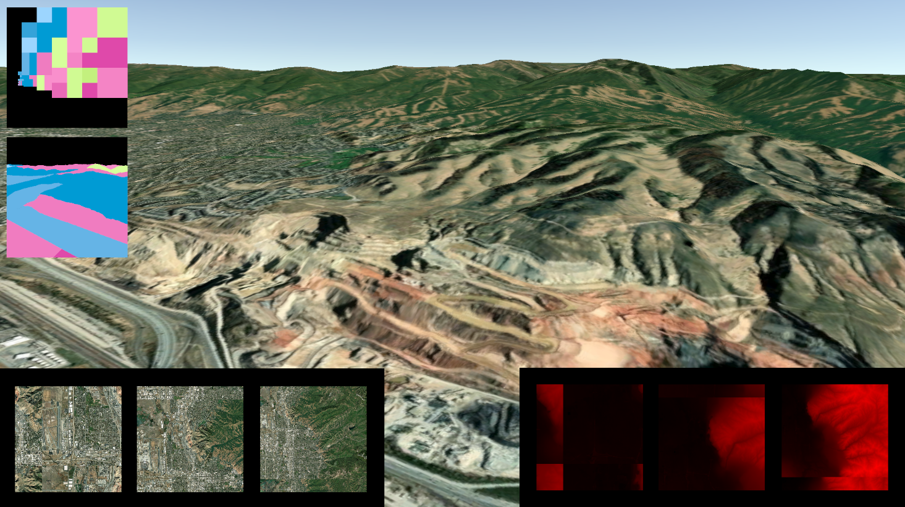

# Unity Clipmap Terrain Renderer

[Video Fly-around (YouTube)](https://youtu.be/TbIpJE5WhIU)

A high-performance Unity terrain rendering system designed for large-scale terrains using clipmaps and adaptive level-of-detail (LOD).

AI was used in development of this project, and the below project description was generated by AI. See [AI-Assisted Development](#ai-assisted-development)

## Features

- **Large-Scale Terrain Support**: Render large terrains with efficient memory usage
- **Clipmap Texture Streaming**: Dynamically load only visible terrain tiles at appropriate detail levels
- **Quadtree LOD System**: Adaptive level-of-detail based on camera distance for optimal performance
- **Addressables Integration**: Asynchronous texture loading using Unity's Addressables system
- **Multi-Layer Support**: Separate clipmaps for albedo/color and height data
- **GPU Fence Synchronization**: Proper memory management with graphics fences
- **Debug Visualization**: Built-in debug views for clipmap levels and tile boundaries
- **Real-time Updates**: Seamless texture streaming as the camera moves

## System Overview

### Clipmap Technology
Clipmaps are a technique for handling very large textures by maintaining a cache of texture data at multiple resolution levels around the viewer. This system:
- Maintains a stack of texture arrays at different LOD levels
- Loads only the visible portions of the terrain in real-time
- Provides seamless transitions between detail levels
- Minimizes GPU memory usage while maintaining visual quality

### Components

#### Clipmap (`Clipmap.cs`)
Core clipmap implementation that manages texture streaming:
- **Texture2DArray Management**: Maintains multiple LOD levels in GPU texture arrays
- **Async Loading**: Uses Unity Addressables for non-blocking texture loads
- **Memory Management**: Tracks loaded textures with GraphicsFence for safe cleanup
- **Tile Coordinate System**: Manages virtual texture space to physical texture mapping

#### Terrain (`Terrain.cs`)
Main terrain renderer with quadtree-based LOD:
- **Quadtree Culling**: Hierarchical spatial partitioning for efficient rendering
- **Distance-based LOD**: Automatic detail level selection based on camera distance
- **Instanced Rendering**: GPU-efficient mesh instancing for terrain tiles
- **Frustum Culling**: Only renders visible terrain sections

#### Terrain Shader (`TerrainShader.shader`)
HLSL shader for terrain rendering:
- **Clipmap Sampling**: Efficient multi-level texture sampling with interpolation
- **Height Displacement**: Vertex shader height mapping from clipmap data
- **LOD Calculation**: Automatic mipmap level selection based on screen-space derivatives
- **Debug Modes**: Visual debugging for clipmap levels and tile boundaries

## Setup

Unity 6.2 was used for development. This repo may not contain all source and projects files required for this to run out of the box.

The data for the terrain textures is not included in this repo. The data was generated from the following page and post-processed with `mipmap_generator.py`

https://manticorp.github.io/unrealheightmap/#latitude/40.878218141046545/longitude/-111.64581298828125/zoom/9/outputzoom/15/width/16384/height/16384

## AI-Assisted Development

Claude Sonnet 4 was used to assist with development.

The primary design and logic of core classes such as Terrain.cs, Clipmap.cs, and TerrainShader.shader were human-developed.

Files that were generated by AI:
- [mipmap_generator.py](Assets/AI%20Generated/mipmap_generator.py)
    - Used to process the full size textures into tiles for clipmap rendering.
- [FirstPersonCameraController.cs](Assets/AI%20Generated/FirstPersonCameraController.cs)
    - A camera control script that mimics Unity's Editor camera controls.
- The above description in this README.md was generated by AI by providing a screenshot and the Terrain.cs and Clipmap.cs source files.

AI was also used throughout the project for:
- Assistance with using the Unity API and C#
    - For example, questions such as "How do I do instance rendering in Unity", "How do I setup a Texture2DArray in a shader", etc.
- Generating code snippets
    - For example, the random color generation function used in the debug visualization shader, ddx/ddy based mipmap LOD calculation, etc.
- Various prototypes and scripts that are no longer needed and not included in the project.

I did not have much prior experience with AI-assisted development, so this was an interesting learning exercise.
